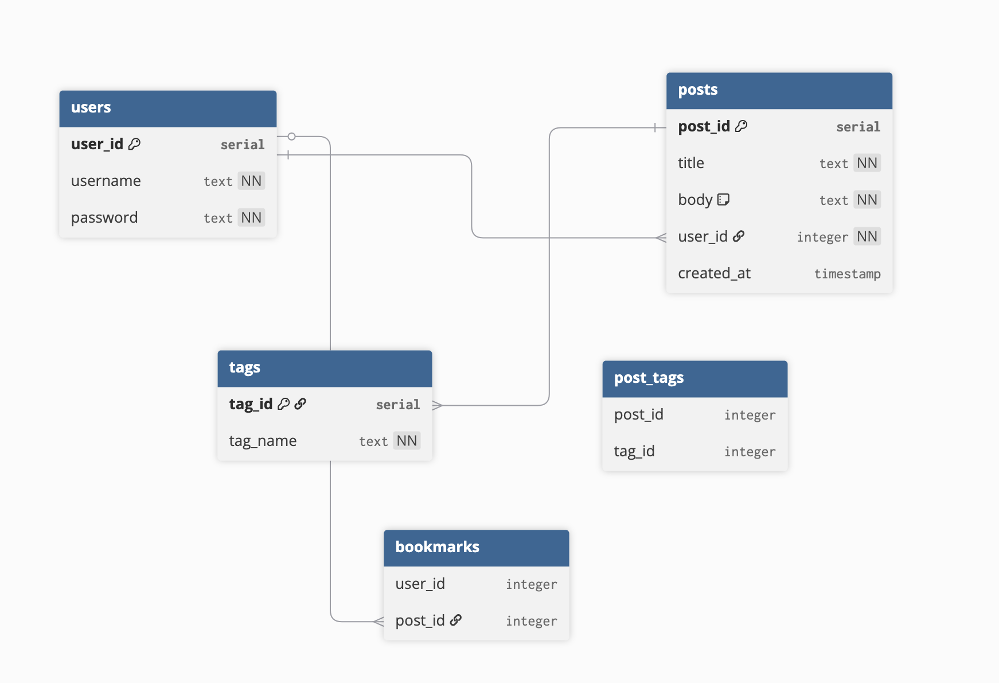

# Capstone Backend

## Project Overview

The goal of this project is to create a site where people can post ideas, tag them based on their categoy, and bookmark ideas on their account to come back to later. The idea is that this will exist as a catch for all the throw away thoughts we have that others may be looking for.

Some inspirations for the UI and design of the site are Pinterest, Twitter, and Reddit.

## Core Features

- Users can scroll through a feed of posts without an account
- Users can generate a random idea without an account
- Users can make an account
- Users can save posts via bookmarks with an account
- Users can post new ideas with an account
- Users can search for specific posts via tags

## Stretch goals

- Users can generate a random idea within a given tag group
- Users can comment on posts
- Search function also works with post text
- Users can organize bookmarks via folders in their account

## Architecture - Backend

Queries are structured into five sections, each with function querying their respective tables. There are three main API routes: users, posts, and tags.

## Current Progress

As of now, the schema and a small inital data seed are completed, as well as the majority of queries. The API routes are mostly complete, save for the users router where a couple routes need to be written/re-written/tested.

## Schema

